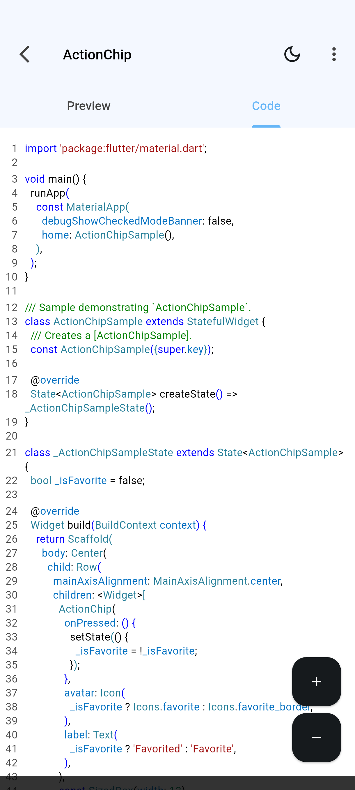

<br>
<div align="center">
  
  
  
  
</div>
<br>

<div align="center">
  <a href="https://github.com/dariomatias-dev/flutter-guide-web/actions/workflows/ci.yml">
    
  </a>
  <a href="https://codecov.io/github/dariomatias-dev/flutter-guide-web">
    
  </a>
  
  <a href="LICENSE">
    
  </a>
</div>
<br>

<p align="center">
  <a href="README.md">English</a> · <strong>Español</strong> · <a href="README.pt-BR.md">Português (BR)</a>
</p>

<h1 align="center">FlutterGuide</h1>

<p align="center">
  El sitio oficial de la app Android FlutterGuide: un catálogo gratuito y de código abierto de ejemplos ejecutables de Flutter y Dart, cada uno con vista previa en vivo y su código fuente.
  <br>
  <a href="#sobre-el-proyecto"><strong>Explora la documentación »</strong></a>
  <br>
  <br>
  <a href="https://github.com/dariomatias-dev/flutter-guide-web/issues/new?template=bug_report.yml">Reportar Bug</a>
  ·
  <a href="https://github.com/dariomatias-dev/flutter-guide-web/issues/new?template=feature_request.yml">Solicitar Funcionalidad</a>
</p>

## Tabla de Contenidos

- [Sobre el Proyecto](#sobre-el-proyecto)
- [Vista Previa](#vista-previa)
- [Funcionalidades](#funcionalidades)
- [La App](#la-app)
- [Tecnologías](#tecnologías)
- [Arquitectura](#arquitectura)
- [Primeros Pasos](#primeros-pasos)
- [Scripts](#scripts)
- [Pruebas](#pruebas)
- [Despliegue](#despliegue)
- [Documentación](#documentación)
- [Contribuir](#contribuir)
- [Seguridad](#seguridad)
- [Licencia](#licencia)
- [Autor](#autor)

## Sobre el Proyecto

Este repositorio contiene el sitio de la app FlutterGuide, en línea en
[flutter-guide-web.vercel.app](https://flutter-guide-web.vercel.app/). Presenta el catálogo de
la app, muestra sus pantallas, responde las dudas más comunes y lleva a la visitante a la Play
Store.

El sitio también sirve las rutas de las que depende la propia app: los enlaces compartibles
(`/widgets/<nombre>` y otras cuatro rutas), el archivo de verificación de los Android App Links
y la política de privacidad a la que apunta la ficha de la tienda.

La app FlutterGuide vive en un repositorio aparte,
[flutter_guide_app](https://github.com/dariomatias-dev/flutter_guide_app).

## Vista Previa

Pantallas de la app, las mismas que el sitio pone frente a la visitante:

<div align="center">



</div>

## Funcionalidades

- Una página en tres idiomas (inglés, portugués y español), enrutada con `next-intl`.
- Una página de changelog construida desde el `CHANGELOG.md` de la app en GitHub, interpretado
  en el build y regenerado cada hora, que también alimenta el adelanto de la portada y la
  insignia de versión de la cabecera.
- Páginas de enlace directo que abren en la app el ejemplo compartido, con la Play Store como
  alternativa.
- Carrusel de capturas con visor a pantalla completa, y un teléfono Android dibujado en CSS.
- Animaciones de entrada y de aparición al desplazar hechas en CSS: sin librería de animación,
  y el contenido sigue visible sin JavaScript y con movimiento reducido.
- Accesibilidad verificada con axe en cada página, en CI.
- SEO: URLs canónicas por idioma, hreflang, sitemap, robots, imagen de Open Graph y JSON-LD.
- Cabeceras de seguridad con Content Security Policy, verificadas de extremo a extremo.

## La App

La app organiza su catálogo en cinco categorías. Cada ejemplo tiene un enlace compartible que
este sitio resuelve dentro de la app:

| Categoría | Qué cubre                                    |
| --------- | -------------------------------------------- |
| Widgets   | Widgets nativos y personalizados             |
| Funciones | Funciones y fragmentos reutilizables en Dart |
| Paquetes  | Paquetes conocidos de la comunidad           |
| Elementos | Piezas menores de interfaz                   |
| UIs       | Patrones de interfaz y pantallas completas   |

Descarga **FlutterGuide** en la **Google Play Store**:

<a href="https://play.google.com/store/apps/details?id=com.dariomatias.flutter_guide" target="_blank">

</a>

## Tecnologías

- Next.js (App Router) con React y TypeScript en modo estricto.
- Tailwind CSS v4, con los tokens definidos en `src/app/globals.css`.
- `next-intl` para enrutamiento, mensajes y formatos en tres idiomas.
- Primitivas de Radix UI (dialog, dropdown menu, accordion), envueltas al estilo shadcn.
- Embla Carousel para las capturas, y Shiki para el resaltado de sintaxis en el build.
- Vitest con Testing Library, y Playwright con axe.
- ESLint, Prettier, Husky, commitlint, Renovate y GitHub Actions.

## Arquitectura

El código se organiza por feature en `src/features/<nombre>/`, con solo lo realmente compartido
en `src/shared/`. La dirección de las dependencias (`app` → `features` → `shared`) la garantiza
ESLint, así que un import que cruza la frontera falla en `pnpm run lint`. Ver
[docs/architecture.es.md](docs/architecture.es.md).

## Primeros Pasos

Requisitos: Node.js 24 o superior, y pnpm 10 (fijado en el campo `packageManager` del
`package.json`).

```bash
git clone https://github.com/dariomatias-dev/flutter-guide-web.git
cd flutter-guide-web
pnpm install
pnpm run dev                  # http://localhost:3000
```

## Scripts

| Comando                      | Descripción                                        |
| ---------------------------- | -------------------------------------------------- |
| `pnpm run dev`               | Servidor de desarrollo                             |
| `pnpm run build`             | Build de producción                                |
| `pnpm run start`             | Sirve el build de producción                       |
| `pnpm run lint`              | ESLint                                             |
| `pnpm run typecheck`         | `tsc --noEmit`                                     |
| `pnpm run format`            | Prettier (escritura)                               |
| `pnpm run test`              | Vitest (modo watch)                                |
| `pnpm run test:run`          | Vitest (una sola ejecución)                        |
| `pnpm run test:coverage`     | Vitest con los mínimos de cobertura                |
| `pnpm run test:e2e`          | Playwright (navegación, a11y, SEO, enlaces de app) |
| `pnpm run check-bundle-size` | Revisa el presupuesto de bundle (requiere build)   |
| `pnpm run verify`            | El gate local completo, en el orden que usa CI     |

## Pruebas

- Pruebas unitarias y de componente con Vitest y Testing Library (`pnpm run test:run`), con
  mínimos de cobertura garantizados en CI.
- Pruebas de extremo a extremo con Playwright (`pnpm run test:e2e`), que cubren navegación,
  accesibilidad con axe, metadatos de SEO y las rutas de las que depende la app Android.
- Un comando ejecuta el mismo gate que CI, en el mismo orden: `pnpm run verify`.

Ver [docs/testing.es.md](docs/testing.es.md) para qué se prueba, qué queda fuera a propósito y
por qué.

## Despliegue

El despliegue corre en Vercel, con una vista previa por pull request y producción al integrar
en `main`. El [CI en GitHub Actions](.github/workflows/ci.yml) ejecuta los gates que bloquean
la integración: formato, lint, tipos, paridad de la documentación, pruebas unitarias con
cobertura, build con presupuesto de bundle y la suite de extremo a extremo. Los escaneos de
dependencias y de secretos corren como informe. Las versiones las genera
[release-please](https://github.com/googleapis/release-please), que mantiene un pull request
abierto con el `CHANGELOG.md` y el incremento de versión.

## Documentación

| Documento                                | Cubre                                          |
| ---------------------------------------- | ---------------------------------------------- |
| [Arquitectura](docs/architecture.es.md)  | Estructura, reglas de capas, decisiones        |
| [Pruebas](docs/testing.es.md)            | Qué se prueba, mínimos de cobertura, huecos    |
| [CI](docs/ci.es.md)                      | Trabajos del pipeline y cómo ejecutarlos local |
| [Dependencias](docs/dependencies.es.md)  | Versiones fijadas, Renovate, triaje            |
| [Rendimiento](docs/performance.es.md)    | Presupuesto de tamaño de bundle                |
| [Seguridad](docs/security.es.md)         | Cabeceras, CSP, escaneo de dependencias        |
| [Contribuir](CONTRIBUTING.md)            | Setup, gate local, pull requests               |
| [Código de Conducta](CODE_OF_CONDUCT.md) | Comportamiento esperado en el proyecto         |

## Contribuir

Los reportes de bugs, las correcciones y los ajustes de contenido son bienvenidos. Ver
[CONTRIBUTING.md](CONTRIBUTING.md) para el setup, el gate local (`pnpm run verify`) y la
convención de commits. La participación se rige por el
[Código de Conducta](CODE_OF_CONDUCT.md).

## Seguridad

¿Encontraste una vulnerabilidad? No abras una issue pública. Ver
[docs/security.es.md](docs/security.es.md) para reportarla en privado.

## Licencia

Distribuido bajo la **Licencia MIT**. Ver el archivo [LICENSE](LICENSE) para los detalles.

## Autor

Desarrollado por **Dário Matias Sales**:

- Portafolio: [https://dariomatias-dev.com](https://dariomatias-dev.com)
- GitHub: [https://github.com/dariomatias-dev](https://github.com/dariomatias-dev)
- Correo: [dariomatias.dev@gmail.com](mailto:dariomatias.dev@gmail.com)
- Instagram: [https://instagram.com/dariomatias_dev](https://instagram.com/dariomatias_dev)
- LinkedIn: [https://linkedin.com/in/dariomatias-dev](https://linkedin.com/in/dariomatias-dev)
