<p align="center">
  
  
  
</p>

<p align="center">
  <a href="README.md">English</a> ·
  <a href="README.es.md">Español</a> ·
  <strong>Português (BR)</strong>
</p>

<h1 align="center">FlutterGuide</h1>

<p align="center">
  O site oficial do app Android FlutterGuide: um companheiro gratuito e
  open-source com widgets, funções, pacotes e ideias de UI selecionados
  para desenvolvedores Flutter.
</p>

<p align="center">
  <a href="#sobre"><strong>Explorar os docs »</strong></a>
  ·
  <a href="https://github.com/dariomatias-dev/flutter-guide-web/issues/new?template=bug_report.yml">Reportar Bug</a>
  ·
  <a href="https://github.com/dariomatias-dev/flutter-guide-web/issues/new?template=feature_request.yml">Sugerir Funcionalidade</a>
</p>

## Sumário

- [Sobre](#sobre)
- [Conteúdo](#conteúdo)
- [Stack](#stack)
- [Arquitetura](#arquitetura)
- [Começando](#começando)
- [Testes](#testes)
- [Scripts](#scripts)
- [Documentação](#documentação)
- [Screenshots](#screenshots)
- [Baixar o App](#baixar-o-app)
- [Contribuindo](#contribuindo)
- [Changelog](#changelog)
- [Licença](#licença)
- [Autor](#autor)

## Sobre

Este é o repositório do site oficial do app FlutterGuide, no ar em
[flutter-guide-web.vercel.app](https://flutter-guide-web.vercel.app/).
Ele apresenta o app, suas categorias de conteúdo, screenshots, e traz um
link direto pra Play Store.

Este repositório contém só o código do site. O código do app FlutterGuide
em si vive num repositório separado.

## Conteúdo

O app organiza conteúdo Flutter em cinco categorias, cada uma com seu
próprio deep link a partir do site (`flutterguide://open.app/<categoria>/<slug>`):

| Categoria | O que cobre                                    |
| --------- | ---------------------------------------------- |
| Widgets   | Widgets nativos e customizados do Flutter      |
| Functions | Funções e trechos de código Dart reutilizáveis |
| Packages  | Pacotes relevantes da comunidade               |
| Elements  | Blocos menores de UI                           |
| UIs       | Padrões completos de UI e ideias de tela       |

## Stack

- **[Next.js](https://nextjs.org/)** (App Router) - framework React,
  totalmente estático.
- **[React](https://react.dev/)** e **[TypeScript](https://www.typescriptlang.org/)**.
- **[Tailwind CSS](https://tailwindcss.com/)** - estilização utility-first.
- **[Radix UI](https://www.radix-ui.com/)** - primitivas acessíveis
  (diálogo, accordion), encapsuladas no estilo shadcn.
- **[Motion](https://motion.dev/)** - animação.
- **[Embla Carousel](https://www.embla-carousel.com/)** - o carrossel de
  screenshots.
- **[Vitest](https://vitest.dev/)** e **[Testing Library](https://testing-library.com/)** - testes unitários e de componente.
- **[Playwright](https://playwright.dev/)** - testes end-to-end.

## Arquitetura

Estrutura feature-first em `src/features/<nome>/`, com código
compartilhado em `src/shared/`. A direção de dependência (`app` →
`features` → `shared`) é garantida pelo ESLint. Veja
[`docs/architecture.md`](docs/architecture.md) pro detalhamento completo
(em inglês).

## Começando

### Pré-requisitos

- Node.js 24+
- [pnpm](https://pnpm.io/) 10 (fixado no campo `packageManager` do
  `package.json`)

### Instalação

```sh
git clone https://github.com/dariomatias-dev/flutter-guide-web.git
cd flutter-guide-web
pnpm install
```

### Rodando localmente

```sh
pnpm run dev
```

Abra [http://localhost:3000](http://localhost:3000) pra ver o resultado.

## Testes

```sh
pnpm run test        # testes unitários/de componente, modo watch
pnpm run test:e2e    # testes end-to-end (Playwright)
pnpm run verify       # o gate local completo: typecheck, lint, format, cobertura, build, e2e
```

A cobertura tem um piso garantido no CI; veja
[`docs/testing.md`](docs/testing.md) (em inglês) pro que é testado, o que
é excluído de propósito, e por quê.

## Scripts

| Script                       | Descrição                                                  |
| ---------------------------- | ---------------------------------------------------------- |
| `pnpm run dev`               | Inicia o servidor de desenvolvimento                       |
| `pnpm run build`             | Build de produção                                          |
| `pnpm run start`             | Serve um build de produção                                 |
| `pnpm run lint`              | ESLint                                                     |
| `pnpm run typecheck`         | `tsc --noEmit`                                             |
| `pnpm run format`            | Formata com Prettier                                       |
| `pnpm run test`              | Testes unitários/de componente (modo watch)                |
| `pnpm run test:e2e`          | Testes end-to-end                                          |
| `pnpm run check-bundle-size` | Verifica o orçamento de bundle JS (precisa de build antes) |
| `pnpm run verify`            | O mesmo gate local que o CI roda                           |

## Documentação

Os documentos abaixo estão em inglês:

| Documento                                      | Cobre                                           |
| ---------------------------------------------- | ----------------------------------------------- |
| [`docs/architecture.md`](docs/architecture.md) | Estrutura do projeto, regras de dependência     |
| [`docs/testing.md`](docs/testing.md)           | O que é testado, piso de cobertura, gaps        |
| [`docs/ci.md`](docs/ci.md)                     | Pipeline de CI/CD, rodando checagens localmente |
| [`docs/dependencies.md`](docs/dependencies.md) | Versões fixas, Renovate, triagem                |
| [`docs/performance.md`](docs/performance.md)   | Orçamento de tamanho de bundle                  |
| [`docs/security.md`](docs/security.md)         | Cabeçalhos, CSP, varredura de dependências      |

## Screenshots

<div align="center">
  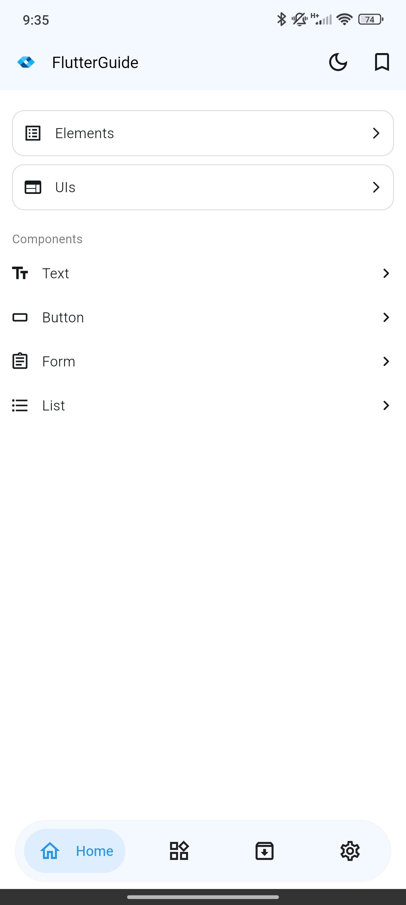
  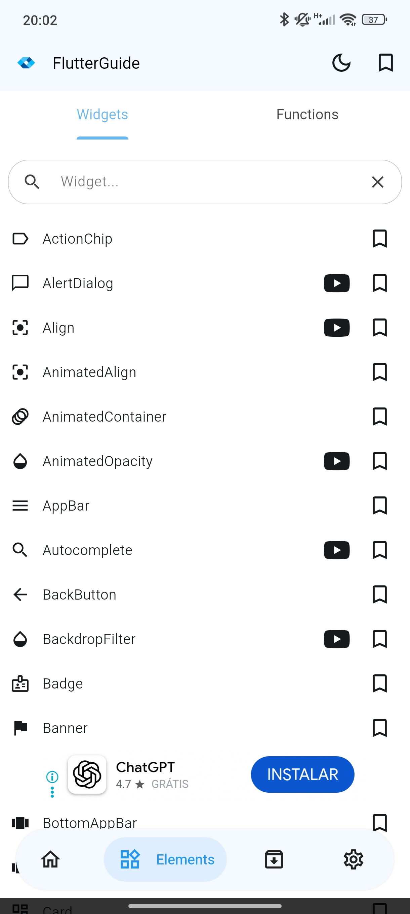
  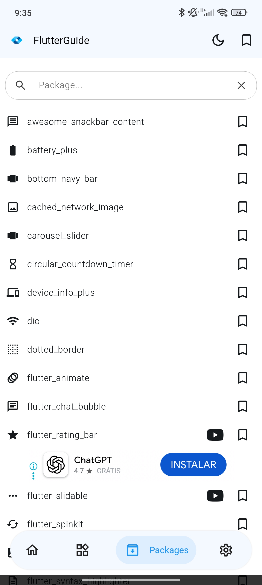
  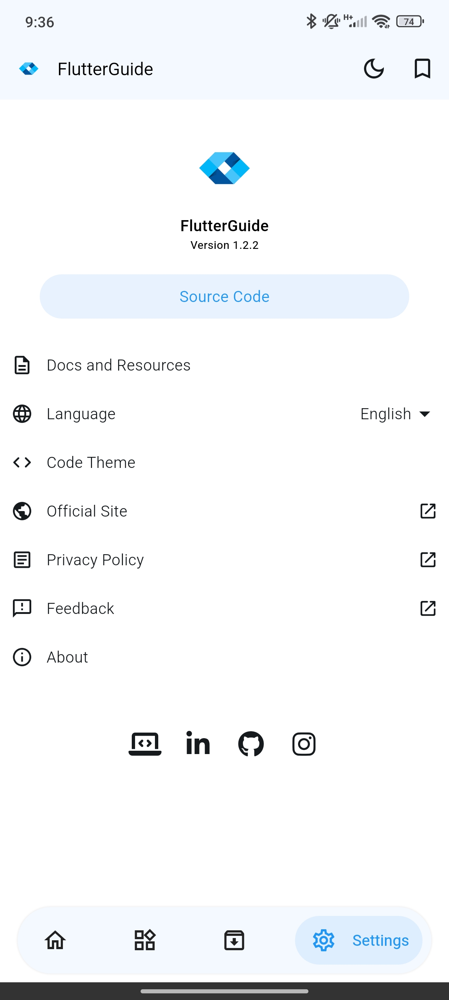
  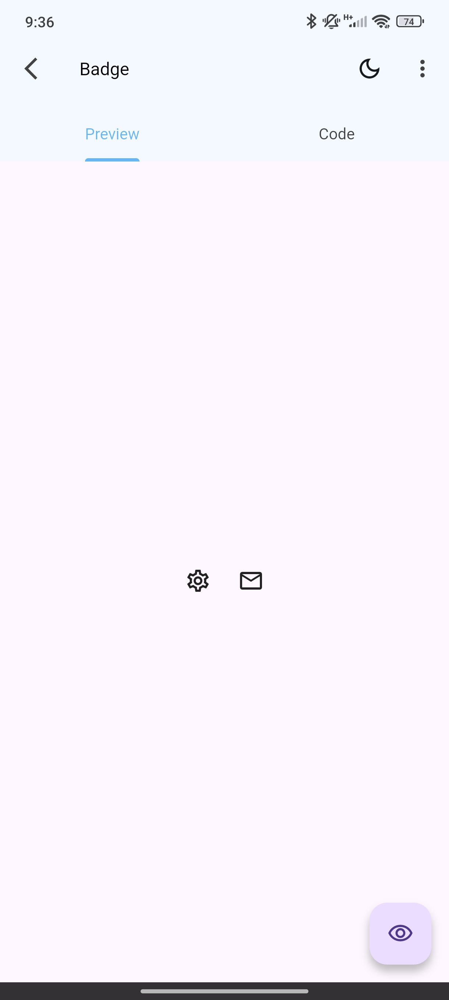
  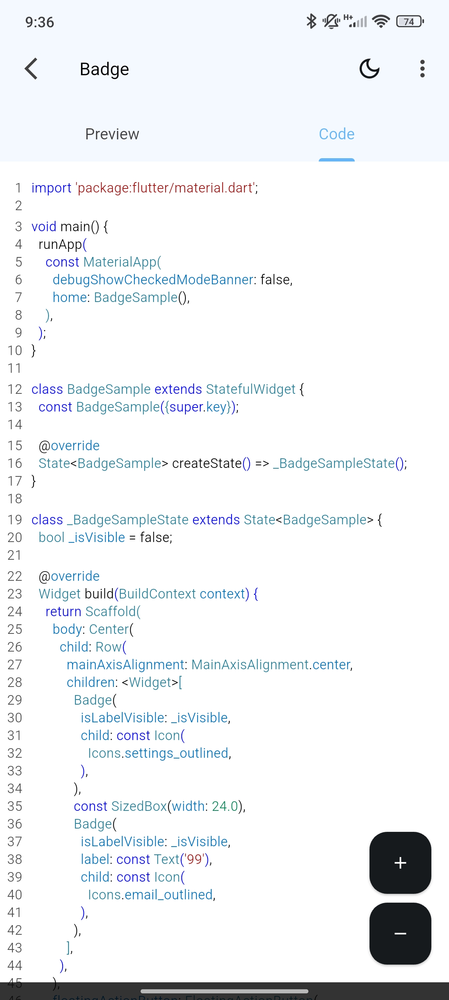
  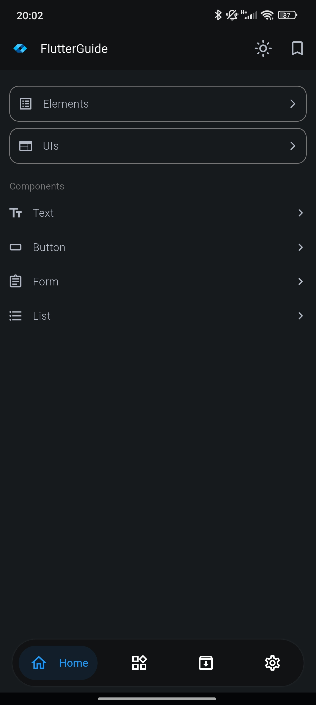
  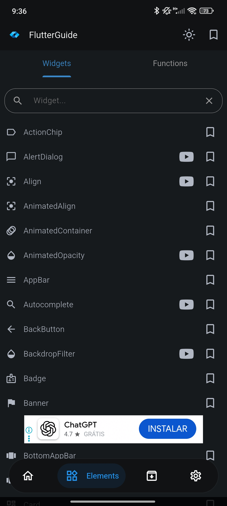
  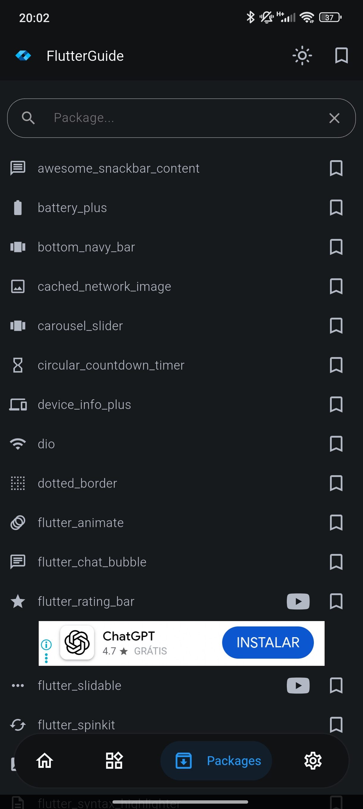
  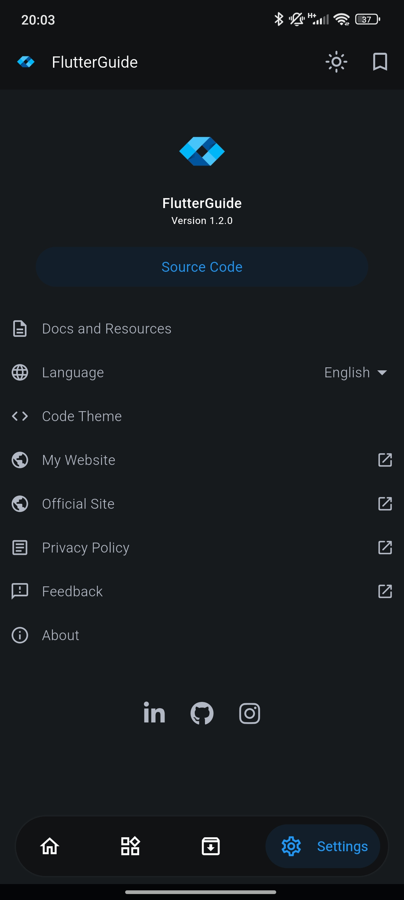
  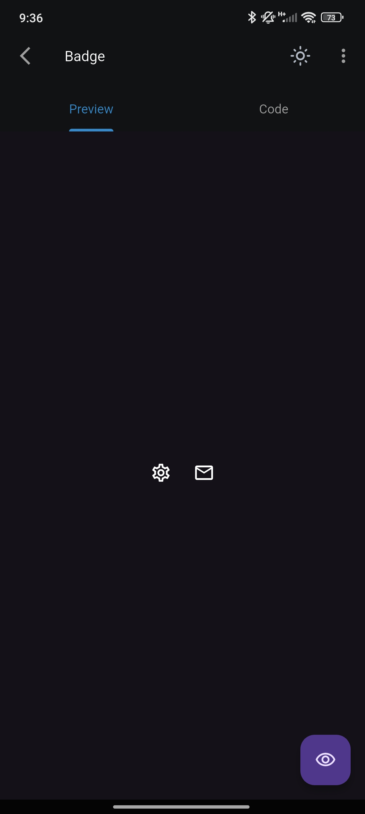
  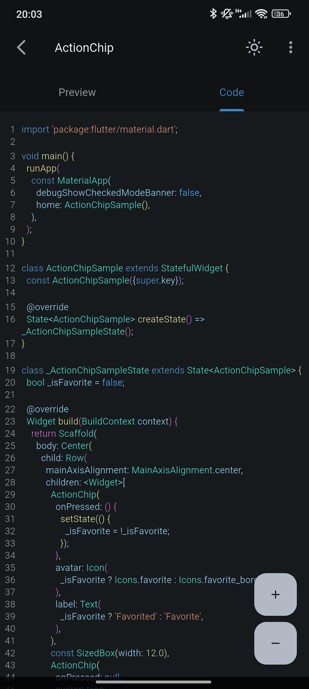
</div>

## Baixar o App

Pegue o **FlutterGuide** na **Google Play Store**:

<a href="https://play.google.com/store/apps/details?id=com.dariomatias.flutter_guide" target="_blank">
  
</a>

## Contribuindo

Contribuições são bem-vindas. Veja [`CONTRIBUTING.md`](CONTRIBUTING.md)
(em inglês) pra configuração local, o gate de verificação, e o checklist
de pull request.

## Changelog

Gerado automaticamente pelo [release-please](https://github.com/googleapis/release-please)
a partir de Conventional Commits. Depois do primeiro release, veja
`CHANGELOG.md`.

## Licença

Distribuído sob a **Licença MIT**. Veja [`LICENSE`](LICENSE) pro texto
completo.

## Autor

Desenvolvido por **Dário Matias**:

- **Portfólio**: [dariomatias-dev.com](https://dariomatias-dev.com)
- **GitHub**: [@dariomatias-dev](https://github.com/dariomatias-dev)
- **E-mail**: [matiasdario75@gmail.com](mailto:matiasdario75@gmail.com)
- **Instagram**: [@dariomatias_dev](https://instagram.com/dariomatias_dev)
- **LinkedIn**: [linkedin.com/in/dariomatias-dev](https://linkedin.com/in/dariomatias-dev)
